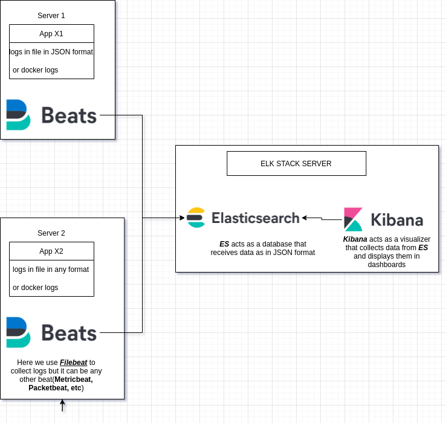

# FILEBEAT + ELASTICSEARCH + KIBANA

In nutshell this is the architecture we want to implement 👇👇

## Filebeat

- Filebeat is a lightweight agent that forwards log data.
- Filebeat is an agent installed on your servers that monitors the log files or even locations that you specify
- It collects log events and forwards them to Elasticsearch or Logstash for indexing

######How does it work 🤔 ??
> When you start **_Filebeat_** it starts one or more **inputs** that look in the locations you've specified for log data and creates a **_harvester_** for each log file.
> The **_harvester_** checks each new content in the file and sends the new log data to the configured **outputs** either **_Elasticsearch_** or **_Logstash_**.
> For more insights check [here](https://www.elastic.co/guide/en/beats/filebeat/current/how-filebeat-works.html)